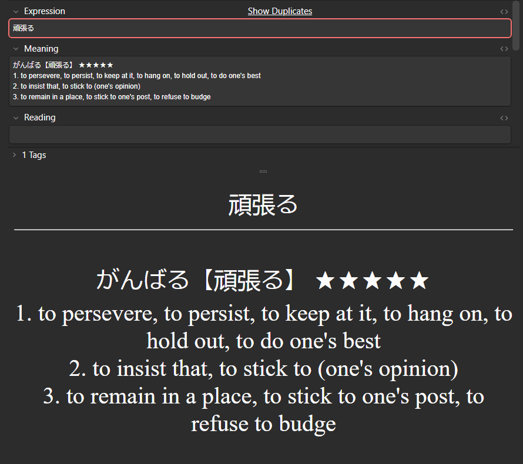
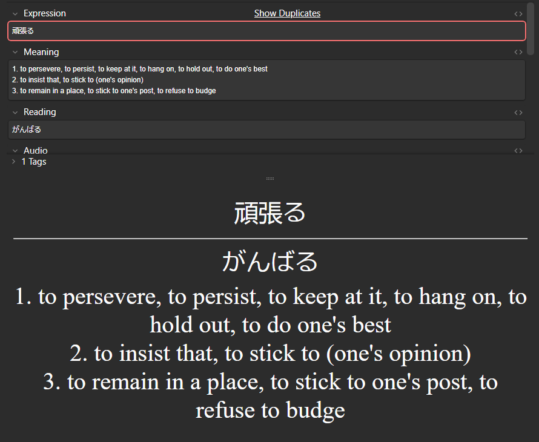
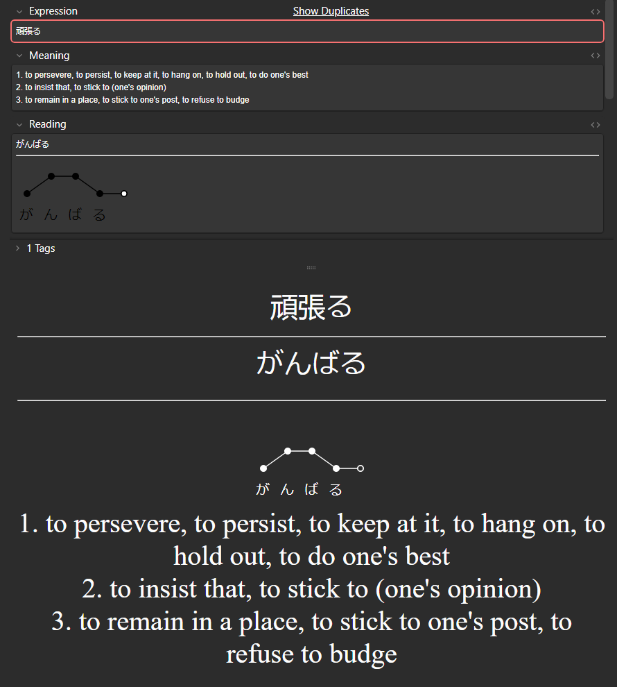
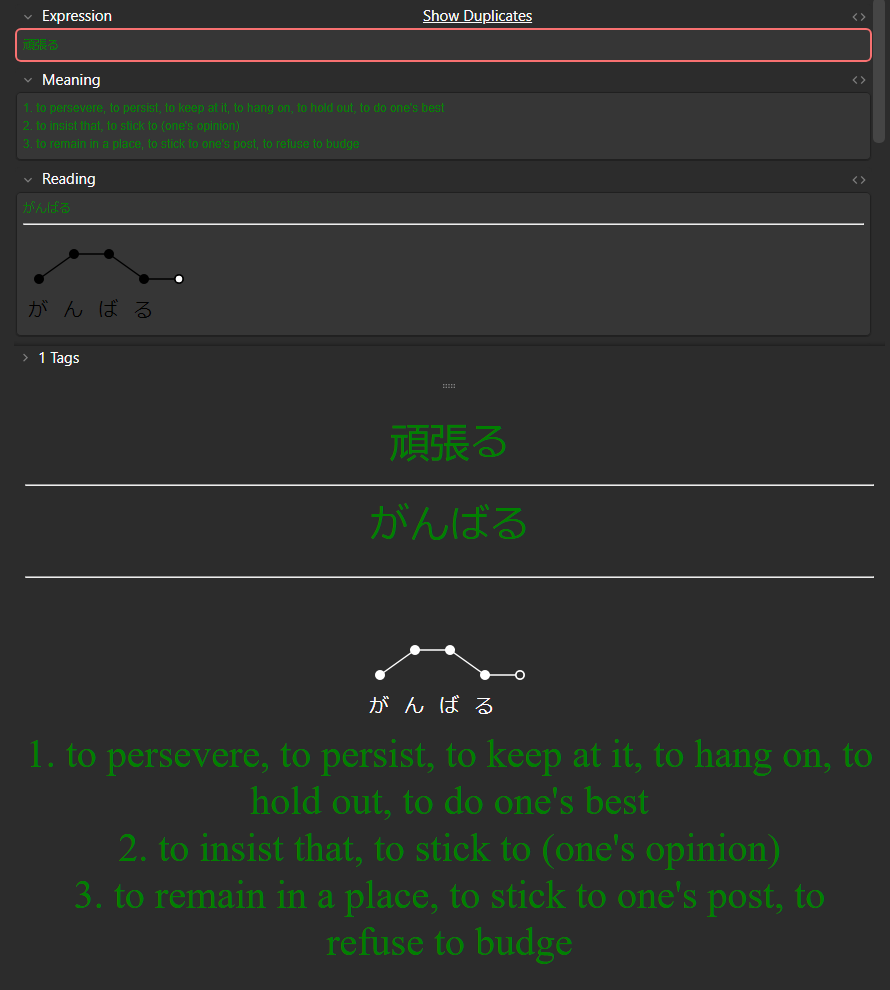

# Sky's Jouzu BulkOps

This is an anki addon that allows you to perform various bulk operations on your cards,
saving you time and effort.

A big shoutout to Cheif ([Jouzu Juls](https://www.youtube.com/@JouzuJuls))
for inspiring me and giving me the tools to start my journey in learning Japanese,
and to everybody in his discord server.
If you follow Cheif, chances are you'll find this addon useful.

## Features

There are currently two bulk operations in this addon:

- Extracting reading from migaku's dictionary output
- Colouring notes' fields based on their pitch accent graph

An operation will be applied to all selected cards,
so it possible to quickly process cards in batches after mining them.
You can find the operations in the deck browser,
either by right-clicking selected cards
or by clicking the `Notes` option in the toolbar.

### Unpacking

This feature lets you extract (and move) the reading of a word from migaku's dictionary output field.

|                  Before                   |                  After                   |
|:-----------------------------------------:|:----------------------------------------:|
|  |  |

The addon will look for the word in brackets and move the hiragana reading on the left to the reading field.

Read the [configuration](#configuration) to find out how to set up right fields.

### Colouring

Like having coloured cards based on the word's pitch?
Wasting time colouring every one of them by hand
with the [Quick Colour Changing](https://ankiweb.net/shared/info/2491935955) addon?

Now you can colour cards automatically with this addon!
Just select the cards you want to colour and start the operation:
the plugin colours the cards based on the inferred pitch accent from the graph.

|                  Before                   |                  After                   |
|:-----------------------------------------:|:----------------------------------------:|
|  |  |

Read the [configuration](#configuration) to find out how to set up right fields and colours.

> **Note:** This isn't meant to discredit the Quick Colour Changing addon,
> which is a useful and awesome addon; I just like to automate things.
> Moreover, I'm sure my addon is bound to fail in some cases,
> and Quick Colour Changing will always come in handy.

> Want to know how to automatically generate the pitch accent graph?
> Check out the [Japanese Pitch Accent](https://ankiweb.net/shared/info/148002038) addon!

## Configuration

You can change the configuration on anki's addon window.

See the [configuration page](resources/config.md) for more information.
